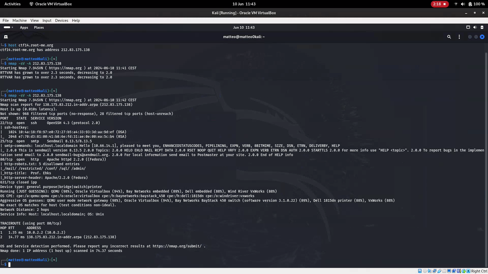
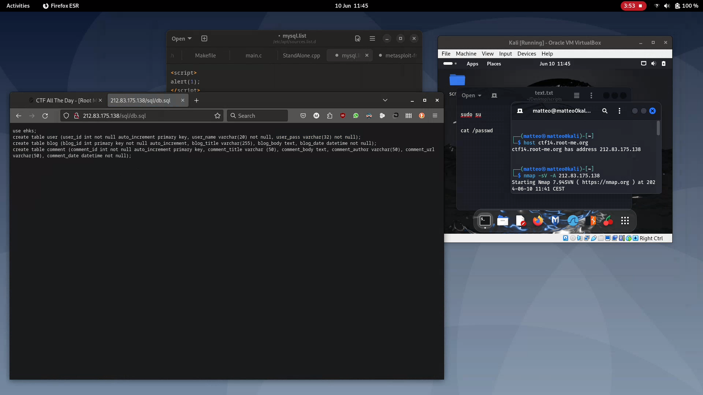
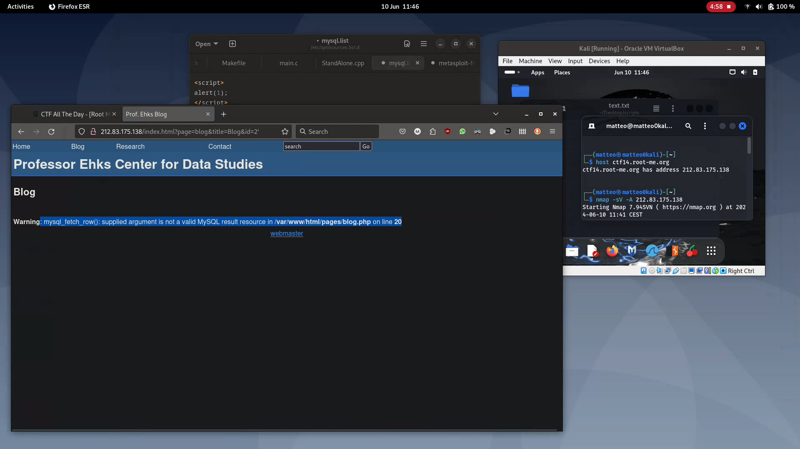
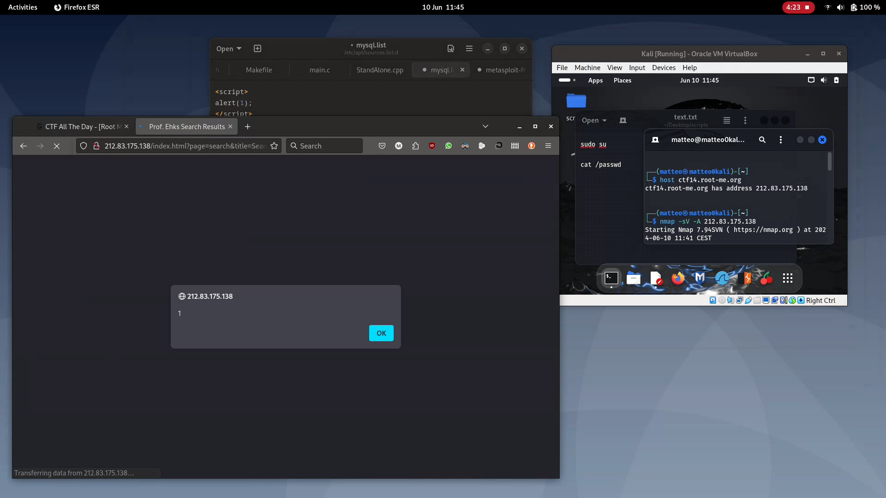
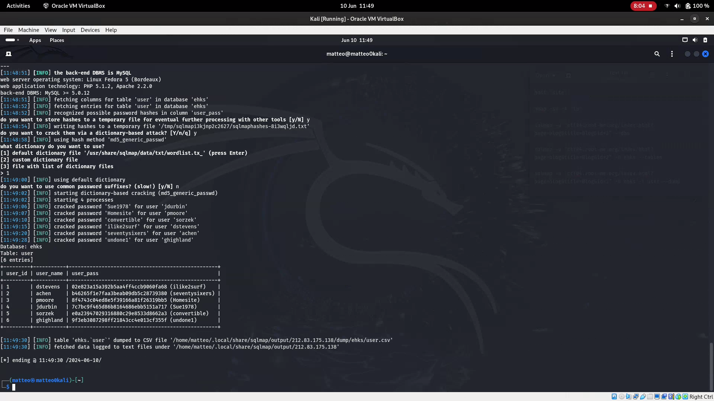
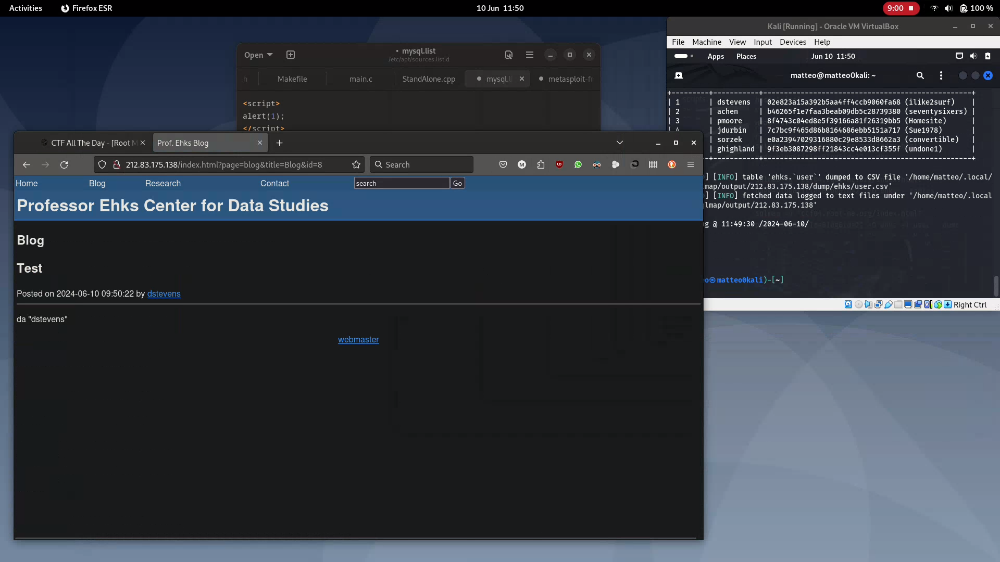
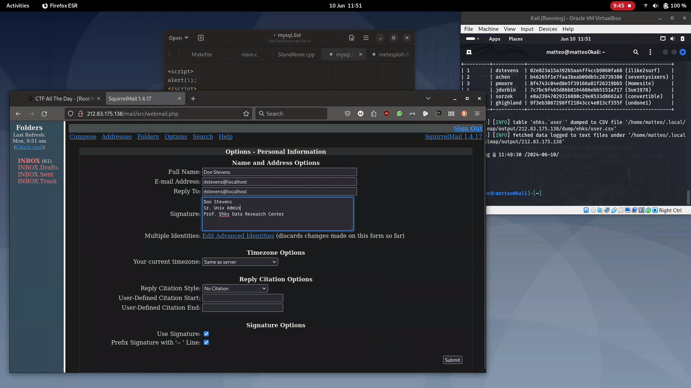
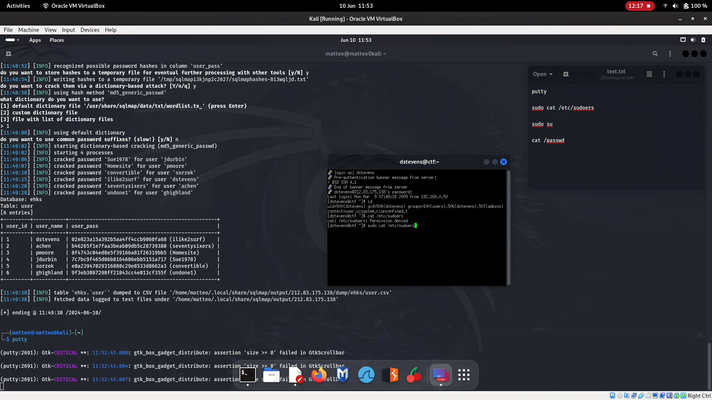

# Progetto cybersecurity: LAMP security CTF4

## Preparazione del progetto
Ho utilizzato una macchina virtuale contenente KaliLinux per effettuare l'attacco. Per simulare la vittima ho usato il servizio di hosting di root-me.org che offre la possibilità di testare le proprie capacità di pentesting.
Threat model: connessione col server.

## Strumenti utilizzati
* Host
* Nmap
* sqlmap
* _jhonn the ripper_ (Non utilizzato in quanto sqlmap aveva una funzione integrata)
* Putty

## Soluzione
### Reconnaissance
Una volta attivata la macchina virtuale mi è stato fornito il suo indirizzo. 
Per incominciare ho recuperato l'indirizzo ip (anche se non necessario per l'esecuzione dell'esercizio) ed eseguito uno scan su tutte le porte per vedere quali server erano in esecuzione. 
Ho trovato tre server in ascolto, tra cui un web server e un ssh server. 
Inoltre nel web server Nmap ho trovato la presenza del file robots.txt. 
Il file robotts.txt è utilizzato principalmente dai motori di ricerca per l'indicizzazione delle pagine, ma può essere utile per trovare pagine non direttamente accessibili dal sito.

Nel file robots.txt erano presenti cinque pagine, tre richiedevano le credenziali per entrare: mail,admin,restricted. 
La pagina conf dava un errore di apache mentre sql conteneva le informazioni sulle tabelle del databese del sito, tra cui la tabella user con le password.

Una volta scoperto la presenza di un database ho cercato il modo di accederci. Ho notato due cose:

1) Le richieste avvenivano in GET
2) La presenza del paramentro id nell'indirizzo all'interno dei blog.

Così ho cercato di rompere la query aggiungendo  '  alla fine dell'URL per triggerare un errore.

Questo dimostra la presenza di una vulnerabilità alle sql injection.
Prima di di procedere in questa direzione ,però ho notato la presenza di una barra di ricerca. 
Inserendo un script all'interno ho verificato la presenza della vulnerabilià XSS. 
Dato che l'obiettivo è quello di entrare nel server ho abbandonato questa strada in quanto l'uso comune degli attacchi XSS prevede come vittima gli altri utenti che usano il server.

## Credential access

Una volta constatata la presenza della vulnerabilità alle sql injection, ho utilizzato sqlmap per cercare di ottenere le credenziali degli utenti che avevo visto nella fase Reconnaissance.
I comandi usati sono stati questi:

1) sqlmap -u "ctf04.root-me.org/index.html?page=blog&title=Blog&id=2" --dbs

2) sqlmap -u "ctf04.root-me.org/index.html?page=blog&title=Blog&id=2" -D ehks --tables

3) sqlmap -u "ctf04.root-me.org/index.html?page=blog&title=Blog&id=2" -D ehks -T user --dump

Il primo comando è riuscito a darmi la lista dei database presenti, mentre il secondo mi ha dato le tabelle presenti nel database ehks.
Il terzo comando invece mi ha permesso di scaricare il conenuto della tabella user, così facendo ho ottenuto guessing material. 
Per il crack delle password ho usato la funzione integrata di sqlmap, le password erano salvate con la funzione hash md5.

Una volta ottenute le credenziali dei vari utenti è stato possibile accedere alla pagina admin. Per dimostrarlo ho aggiunto un post al blog

Gli account del sito non permettono di fare altro, però sono riuscito ad entrare nella mail usando le stesse credenziali.
Ho raccoloto solo informazioni personali, nulla che mi potesse aiutre nell'intento di entrare nella macchina virtuale.

Il report di Nmap indicava la presenza di una porta ssh in ascolto, quindi usando sempre le stesse credenzali e mi sono conesso al server. 
All'inizio ho provato a connettermi tramite linea di comando, ma mi dava errore a causa di algortmi di cifratura non più utilizzati. 
Il problema è stato ovviato usando putty.
Il Privilege Escalation è stato facile in quanto l'utente che ho impersonato faceva parte del gruppo degli admin. 
Eseguendo il comando "sudo su" e ripetendo la stessa password usata per l'accesso ssh ho ottenuto il privilegio di root.

## Conclusione

Sono state due le principali vulnerabilità che mi hanno permesso di ottenere il controllo della macchina:
1) la sql injection.
2) la scarsa igiene di sicurezza in quanto le stesse credenziali erano valide in tre situazioni diverse: login del sito, mail, ssh.

Migliorie che andrebbero apportate: 
* Nel web server andrebbero sostituite le chiamate GET con le chiamate POST.
* Usare crendeziali diverse per ogni servizio.
* Proteggersi dalle sql injection (ex. usando le store precedure).
* Nel file robots.txt rimuovere file come \conf\ oppure \sql\ o almeno limitare l'accesso a solo gli admin.
* Proteggersi dagli attacchi XSS.
* La tecnica di salvare gli hash delle password è corretta, ma andrebbe usata una funzione di hash sicura e andrebbe aggiunto il salt per rendere più laborioso il tentativo di indovinare le password.
* Infine non usare il protocollo http ma usare https.

## Link consulati per lo svolgimento del progetto

https://chousensha.github.io/blog/2016/04/19/pentest-lab-lampsecurity-ctf4/

https://syrion89.wordpress.com/2016/12/20/lamp-security-ctf4/

https://www.youtube.com/watch?v=J2aZMSJeSm0&t=592s

